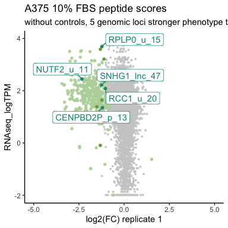
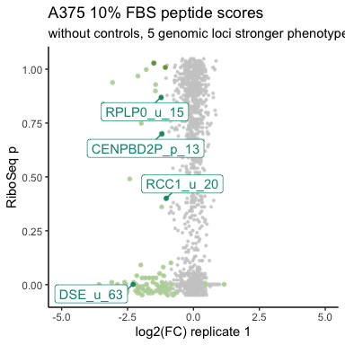
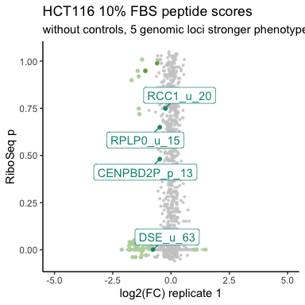
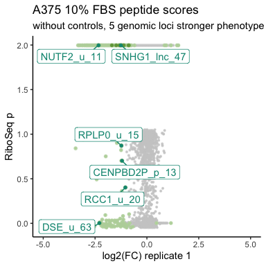
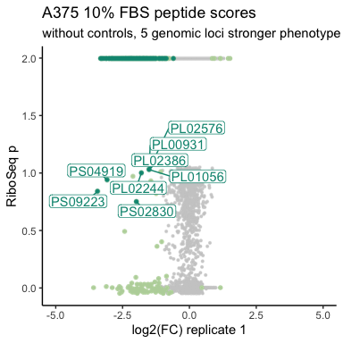
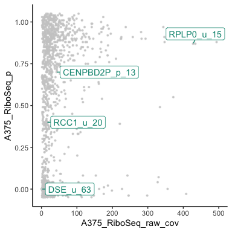

```r
library(ggplot2)
library(dplyr)
```

```
## 
## Attaching package: 'dplyr'
```

```
## The following objects are masked from 'package:stats':
## 
##     filter, lag
```

```
## The following objects are masked from 'package:base':
## 
##     intersect, setdiff, setequal, union
```

```r
library(ggrastr)
library(ggrepel)

df <- read.csv(
    file = "./gene_summaries_final_v3.csv",
    na.strings = c("#N/A", "NA"))
df$A375_RiboSeq_p <- as.numeric(df$A375_RiboSeq_p)
```

```
## Warning: NAs introduced by coercion
```

```r
df$HCT116_RiboSeq_p <- as.numeric(df$HCT116_RiboSeq_p)
```

```
## Warning: NAs introduced by coercion
```

```r
# If you want to export it to svg with no problems with the points use it
logfc_guides <- list(
    geom_hline(yintercept = c(-1, 1), linetype = "dotted", color = "#777777", linewidth=0.1),
    geom_vline(xintercept = c(-1, 1), linetype = "dotted", color = "#777777",linewidth=0.1),
    geom_hline(yintercept = c(0), linewidth=0.1),
    geom_vline(xintercept = c(0),linewidth=0.1))

df$RNAseq_TPM <- rowMeans(select(df,starts_with("TPM_A375_Cas9_TRAC")))
#df$RNAseq_TPM[is.na(df$RNAseq_TPM)] <- 0
df$RNAseq_logTPM <- log10(df$RNAseq_TPM+0.01)
#df$Ribo_logCov <- log10(df$Ribo_seq_mean_cov+0.01)

df=df %>% filter(!startsWith(new_id, "RP")& !(startsWith(new_id, "C")))

#read in candidate lists
candidates <- c(
    "PS04061", 
    "PS05637", 
    "PL01811", 
    "PS02457", 
    "PS01753", 
    "PL00150", 
    "PS10094", 
    "PS04125", 
    "PS05879", 
    "PL00330", 
    "PS05633", 
    "PS05326", 
    "PS05565", 
    "PS05338", 
    "PS05634", 
    "PS07624",
    # These are the same but I am not deduplicating for these
    "PL00931", 
    "PL01056", 
    "PL02386", 
    "PL02576",    
    "NUTF2_u_11", 
    "CENPBD2P_p_13", 
    "DSE_u_63", 
    "RCC1_u_20", 
    "RPLP0_u_15", 
    "SNHG1_lnc_47"
)

top_6 <- c(
    "NUTF2_u_11", 
    "CENPBD2P_p_13", 
    "DSE_u_63", 
    "RCC1_u_20", 
    "RPLP0_u_15", 
    "SNHG1_lnc_47"
)


#Hit criteria: LFC </= -1 or LFC >/= 1

#Naming legend
#top 6 candidates
#PS04061	--> #19 NUTF2_u_11
#PS05637	--> #16 CENPBD2P_p_13
#PL01811	--> #1 DSE_u_63
#PS02457 -->	#2 RCC1_u_20
#PS01753	-->#11 RPLP0_u_15
#PL00150	--> #12  SNHG1_lnc_47

#change sORF name to that of the gene
df$new_id[df$new_id=="PL01811"]="DSE_u_63"
df$new_id[df$new_id=="PS05637"]="CENPBD2P_p_13"
df$new_id[df$new_id=="PS02457"]="RCC1_u_20"
df$new_id[df$new_id=="PS01753"]="RPLP0_u_15"
df$new_id[df$new_id=="PS04061"]="NUTF2_u_11"
df$new_id[df$new_id=="PL00150"]="SNHG1_lnc_47"

#make dataframe without any controls 
df_no_controls=df
#colnames(df)

    
library(dplyr)
#make plot

ggplot(df_no_controls, aes(x=A375_r2_1_0_lfc, y=RNAseq_logTPM,label=new_id)) +
    rasterise(geom_point(color = "#cccccc", alpha = 0.8, size = 0.5), dpi = 300) +
    rasterise(geom_point(data = df_no_controls %>% filter( rowMeans(df_no_controls[,c("A375_r2_1_0_lfc","A375_r1_1_0_lfc")]) <= -1 |rowMeans(df_no_controls[,c("A375_r2_1_0_lfc","A375_r1_1_0_lfc")]) >= 1), color = "#B9D4A8", size = 1), dpi = 300)+
    rasterise(geom_point(data = df_no_controls%>% filter(new_id %in% candidates), color = "#70A147", size = 1), dpi = 300) +
  rasterise(geom_point(data = df_no_controls%>% filter(new_id %in% top_6), color = "#039480", size = 1), dpi = 300) +
    geom_label_repel(data = df_no_controls %>% filter(new_id %in% top_6), color = "#039480", min.segment.length = 0.1) +
    theme(axis.title.x = element_text(color="black", ),axis.title.y = element_text(color="black"), axis.text.x = element_text(color="black"),axis.text.y = element_text(color="black"))+
    labs(x="log2(FC) replicate 1", y= "RNAseq_logTPM") +
    labs(title = "A375 10% FBS peptide scores",subtitle = "without controls, 5 genomic loci stronger phenotype than PS04061")+
    coord_cartesian(xlim = c(-5, 5)) +
    theme_classic()
```

```
## Warning: Removed 1516 rows containing missing values or values outside the scale range
## (`geom_point()`).
```

```
## Warning: Removed 25 rows containing missing values or values outside the scale range
## (`geom_point()`).
```

```
## Warning: Removed 2 rows containing missing values or values outside the scale range
## (`geom_point()`).
```

```
## Warning: Removed 1 row containing missing values or values outside the scale range
## (`geom_point()`).
```

```
## Warning: Removed 1 row containing missing values or values outside the scale range
## (`geom_label_repel()`).
```

<!-- -->

```r
ggsave('A375_10FBS_candidates_top6_RNAseq.pdf')
```

```
## Saving 4 x 4 in image
```

```
## Warning: Removed 1516 rows containing missing values or values outside the scale range
## (`geom_point()`).
```

```
## Warning: Removed 25 rows containing missing values or values outside the scale range
## (`geom_point()`).
```

```
## Warning: Removed 2 rows containing missing values or values outside the scale range
## (`geom_point()`).
```

```
## Warning: Removed 1 row containing missing values or values outside the scale range
## (`geom_point()`).
```

```
## Warning: Removed 1 row containing missing values or values outside the scale range
## (`geom_label_repel()`).
```


```r
library(ggrastr)
# If you want to export it to svg with no problems with the points use it
#make plot

df_no_controls <- df_no_controls[!is.na(df_no_controls$A375_RiboSeq_p),]

ggplot(df_no_controls, aes(x=A375_r2_1_0_lfc, y=A375_RiboSeq_p,label=new_id)) +
    rasterise(geom_point(color = "#cccccc", alpha = 0.8, size = 0.5), dpi = 300) +
    rasterise(geom_point(data = df_no_controls %>% filter( rowMeans(df_no_controls[,c("A375_r2_1_0_lfc","A375_r1_1_0_lfc")]) <= -1 |rowMeans(df_no_controls[,c("A375_r2_1_0_lfc","A375_r1_1_0_lfc")]) >= 1), color = "#B9D4A8", size = 1), dpi = 300)+
    rasterise(geom_point(data = df_no_controls%>% filter(new_id %in% candidates), color = "#70A147", size = 1), dpi = 300) +
  rasterise(geom_point(data = df_no_controls%>% filter(new_id %in% top_6), color = "#039480", size = 1), dpi = 300) +
    geom_label_repel(data = df_no_controls %>% filter(new_id %in% top_6), color = "#039480", min.segment.length = 0,max.time = 5) +
    theme(axis.title.x = element_text(color="black", ),axis.title.y = element_text(color="black"), axis.text.x = element_text(color="black"),axis.text.y = element_text(color="black"))+
    labs(x="log2(FC) replicate 1", y= "RiboSeq p") +
    labs(title = "A375 10% FBS peptide scores",subtitle = "without controls, 5 genomic loci stronger phenotype than PS04061")+
    coord_cartesian(xlim = c(-5, 5)) +
    theme_classic()
```

<!-- -->

```r
ggsave('A375_10FBS_candidates_top6_ribo.pdf')
```

```
## Saving 4 x 4 in image
```


```r
library(ggrastr)
# If you want to export it to svg with no problems with the points use it
#make plot

df_no_controls <- df_no_controls[!is.na(df_no_controls$HCT116_RiboSeq_p),]

ggplot(df_no_controls, aes(x=HCT116_r2_1_0_lfc, y=HCT116_RiboSeq_p,label=new_id)) +
    rasterise(geom_point(color = "#cccccc", alpha = 0.8, size = 0.5), dpi = 300) +
    rasterise(geom_point(data = df_no_controls %>% filter( rowMeans(df_no_controls[,c("HCT116_r2_1_0_lfc","HCT116_r1_1_0_lfc")]) <= -1 |rowMeans(df_no_controls[,c("HCT116_r2_1_0_lfc","HCT116_r1_1_0_lfc")]) >= 1), color = "#B9D4A8", size = 1), dpi = 300)+
    rasterise(geom_point(data = df_no_controls%>% filter(new_id %in% candidates), color = "#70A147", size = 1), dpi = 300) +
  rasterise(geom_point(data = df_no_controls%>% filter(new_id %in% top_6), color = "#039480", size = 1), dpi = 300) +
    geom_label_repel(data = df %>% filter(new_id %in% top_6), color = "#039480", min.segment.length = 0,max.time = 5) +
    theme(axis.title.x = element_text(color="black", ),axis.title.y = element_text(color="black"), axis.text.x = element_text(color="black"),axis.text.y = element_text(color="black"))+
    labs(x="log2(FC) replicate 1", y= "RiboSeq p") +
    labs(title = "HCT116 10% FBS peptide scores",subtitle = "without controls, 5 genomic loci stronger phenotype than PS04061")+
    coord_cartesian(xlim = c(-5, 5)) +
    theme_classic()
```

```
## Warning: Removed 2 rows containing missing values or values outside the scale range
## (`geom_label_repel()`).
```

<!-- -->

```r
ggsave('HCT116_10FBS_candidates_top6_ribo.pdf')
```

```
## Saving 4 x 4 in image
```

```
## Warning: Removed 2 rows containing missing values or values outside the scale range
## (`geom_label_repel()`).
```


```r
df_no_controls <- df
df_no_controls$A375_RiboSeq_p[is.na(df_no_controls$A375_RiboSeq_p)] <- 2

ggplot(df_no_controls, aes(x=A375_r2_1_0_lfc, y=A375_RiboSeq_p,label=new_id)) +
    rasterise(geom_point(color = "#cccccc", alpha = 0.8, size = 0.5), dpi = 300) +
    rasterise(geom_point(data = df_no_controls %>% filter( rowMeans(df_no_controls[,c("A375_r2_1_0_lfc","A375_r1_1_0_lfc")]) <= -1 |rowMeans(df_no_controls[,c("A375_r2_1_0_lfc","A375_r1_1_0_lfc")]) >= 1), color = "#B9D4A8", size = 1), dpi = 300)+
    rasterise(geom_point(data = df_no_controls%>% filter(new_id %in% candidates), color = "#70A147", size = 1), dpi = 300) +
  rasterise(geom_point(data = df_no_controls%>% filter(new_id %in% top_6), color = "#039480", size = 1), dpi = 300) +
    geom_label_repel(data = df_no_controls %>% filter(new_id %in% top_6), color = "#039480", min.segment.length = 0,max.time = 5) +
    theme(axis.title.x = element_text(color="black", ),axis.title.y = element_text(color="black"), axis.text.x = element_text(color="black"),axis.text.y = element_text(color="black"))+
    labs(x="log2(FC) replicate 1", y= "RiboSeq p") +
    labs(title = "A375 10% FBS peptide scores",subtitle = "without controls, 5 genomic loci stronger phenotype than PS04061")+
    coord_cartesian(xlim = c(-5, 5)) +
    theme_classic()
```

<!-- -->

```r
ggsave('A375_10FBS_candidates_ribo_NAas2.pdf')
```

```
## Saving 4 x 4 in image
```

```r
hi_fc_ribo <- df_no_controls$new_id[df_no_controls$A375_r1_1_0_lfc < -1.5 & df_no_controls$A375_RiboSeq_p > 0.5]

ggplot(df_no_controls, aes(x=A375_r2_1_0_lfc, y=A375_RiboSeq_p,label=new_id)) +
    rasterise(geom_point(color = "#cccccc", alpha = 0.8, size = 0.5), dpi = 300) +
    rasterise(geom_point(data = df_no_controls %>% filter( rowMeans(df_no_controls[,c("A375_r2_1_0_lfc","A375_r1_1_0_lfc")]) <= -1 |rowMeans(df_no_controls[,c("A375_r2_1_0_lfc","A375_r1_1_0_lfc")]) >= 1), color = "#B9D4A8", size = 1), dpi = 300)+
  rasterise(geom_point(data = df_no_controls%>% filter(new_id %in% hi_fc_ribo), color = "#039480", size = 1), dpi = 300) +
    geom_label_repel(data = df_no_controls %>% filter(new_id %in% hi_fc_ribo), color = "#039480", min.segment.length = 0,max.time = 50,box.padding = 0.1, label.padding = 0.1) +
    theme(axis.title.x = element_text(color="black", ),axis.title.y = element_text(color="black"), axis.text.x = element_text(color="black"),axis.text.y = element_text(color="black"))+
    labs(x="log2(FC) replicate 1", y= "RiboSeq p") +
    labs(title = "A375 10% FBS peptide scores",subtitle = "without controls, 5 genomic loci stronger phenotype than PS04061")+
    coord_cartesian(xlim = c(-5, 5)) +
    theme_classic()
```

```
## Warning: ggrepel: 255 unlabeled data points (too many overlaps). Consider
## increasing max.overlaps
```

<!-- -->

```r
ggsave('A375_10FBS_candidates_hi_fc_hi_ribo.pdf')
```

```
## Saving 4 x 4 in image
```

```
## Warning: ggrepel: 255 unlabeled data points (too many overlaps). Consider
## increasing max.overlaps
```


```r
df_no_controls <- df[!is.na(df$HCT116_RiboSeq_p),]
ggplot(df_no_controls, aes(x=A375_RiboSeq_raw_cov, y=A375_RiboSeq_p,label=new_id)) +
    rasterise(geom_point(color = "#cccccc", alpha = 0.8, size = 0.5), dpi = 300) +
    theme_classic() +geom_label_repel(data = df_no_controls %>% filter(new_id %in% top_6), color = "#039480", min.segment.length = 0,max.time = 5) + coord_cartesian(xlim=c(0,500))
```

<!-- -->

```r
  ggsave('A375_10FBS_candidates_ribo_Cov_vs_Score.pdf')
```

```
## Saving 4 x 4 in image
```
